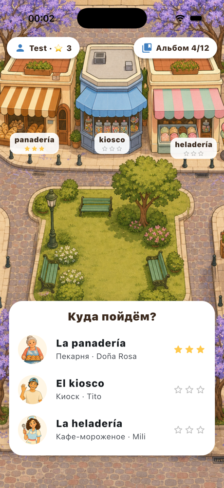
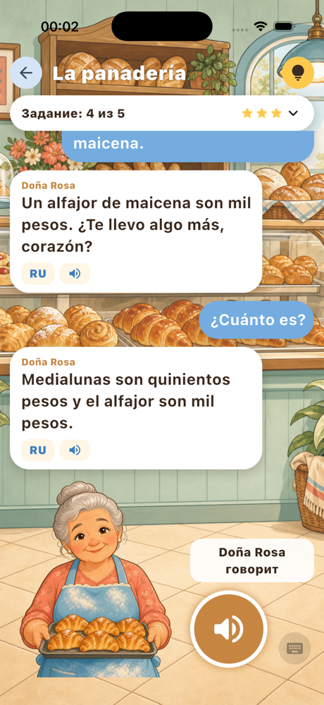
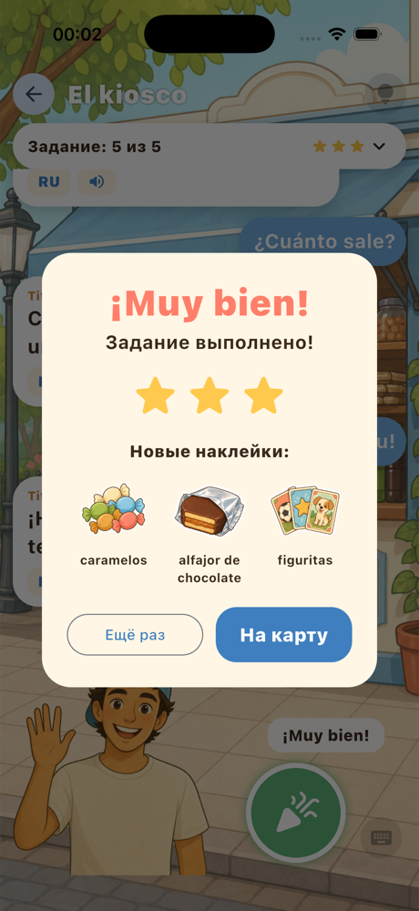

# Mi Barrio 🧉

**An offline iPhone game where kids practice Argentine Spanish by talking to AI shopkeepers in a Buenos Aires neighborhood.**

Built for the [**DEV Hacktoberfest Weekend Challenge 2026: Build for a Friend**](https://dev.to/challenges/hacktoberfest-weekend-2026-10-01) (October 2026). The "friends" are my two children, 9 and 10. Their first language is Russian, and they have to learn Spanish, specifically the Rioplatense kind, with *vos*, *che* and *medialunas*.

<p align="center">
  
  
  
</p>

🎬 **Demo:** [watch on YouTube](https://youtube.com/shorts/pj6c-IQYnVY) · 📝 **Story:** [read on DEV](https://dev.to/yahhi/mi-barrio-my-kids-practice-argentine-spanish-with-ai-shopkeepers-that-live-on-the-phone-3i4l)

## How it plays

Three shops, three characters, each a mission with five small goals written in Russian:

| Shop | Character | The child has to… |
|---|---|---|
| La panadería | Doña Rosa | greet her, ask for three medialunas, add an alfajor, ask the price, say goodbye |
| El kiosco | Tito | ask for figuritas, buy candy, ask the price… |
| La heladería | Mili | ask which flavors there are, pick a cone or a cup, choose a flavor… |

1. The child taps the microphone and **speaks Spanish**.
2. **Whisper** writes down what they said, and the goals tick off as they're reached.
3. **Gemma** answers in character, in Rioplatense Spanish with *voseo*.
4. **Piper** says the answer out loud in an Argentine voice.

When the child gets stuck, 💡 shows a ready phrase with its Russian translation and can say it aloud. Any character line can be translated (RU) or replayed (🔊). No hints gives ★★★, and stars unlock stickers for an album.

## Everything runs on the phone

| Job | Open model | Runtime | Size |
|---|---|---|---|
| Plays the characters, translates | [Gemma 4 E2B](https://huggingface.co/litert-community/gemma-4-E2B-it-litert-lm) (Apache 2.0) | [flutter_gemma](https://pub.dev/packages/flutter_gemma) on LiteRT-LM, GPU | 2.6 GB, downloaded on first launch |
| Hears the child | [Whisper small](https://huggingface.co/csukuangfj/sherpa-onnx-whisper-small) int8 (MIT) | [sherpa-onnx](https://github.com/k2-fsa/sherpa-onnx) | 375 MB, downloaded on first launch |
| Speaks | Piper `es_AR-daniela-high`, `es_MX-ald-medium` | sherpa-onnx | bundled (Git LFS) |

No account, no server, no API keys. After the first download it works offline, and nothing the child says leaves the device.

### Design rule: AI for the conversation, code for the game

The language model does what only a language model can do: hold a natural conversation that's a little different every time, while staying in character. Each character has a short persona with personality, prices and strict rules: *voseo* only, at most two short sentences, simple words, no personal questions, no corrections.

Everything that decides whether a child succeeded is deterministic code in [`lib/game/missions.dart`](lib/game/missions.dart):

- goals are keyword checks on the transcript, accent-insensitive and tolerant of small misspellings ("medielunas" still counts)
- stars, hints and stickers are plain rules
- all of it is covered by `flutter test`

Small models are bad at arithmetic, so the characters name prices per item and never add up a total.

## Run it

Requirements: Flutter 3.47+, Xcode 26, an iPhone with iOS 15+ (tested on an iPhone 17 Pro Max; target is an iPhone 12 Pro with 6 GB RAM). Android should work but is untested.

```bash
git lfs install && git clone https://github.com/Yahhi/mi-barrio.git
cd mi-barrio
flutter pub get
flutter run --release            # first launch downloads ~3 GB over Wi‑Fi
flutter test                     # goal matching, stars, sticker rules
```

Debug helpers:

```bash
flutter run --dart-define=SELFTEST=true          # TTS → STT → LLM round trip with timings
flutter run --dart-define=START=mission:kiosco \
  "--dart-define=DEMO_SAY=¡Hola, Tito!|¿Tenés figuritas?|Quiero cinco caramelos.|¿Cuánto sale?|¡Gracias! ¡Chau!"
                                                 # plays the child's side by itself
```

## Project layout

```
lib/
  game/missions.dart    # missions, goals, hints, character prompts, stickers ← edit content here
  game/progress.dart    # players, stars, sticker album (shared_preferences)
  ai/brain.dart         # Gemma: character chat + Russian translation
  ai/speech.dart        # Whisper + Piper in a background isolate
  ai/model_files.dart   # first-launch downloads, bundled voices
  ai/audio.dart         # mic recording and playback
  screens/              # setup, players, map, mission, album
```

## What testing with the kids taught us (and what's next)

- **More places.** They finished all three missions in about 10 minutes and asked for more. Next: the colectivo, the plaza, the doctor.
- **Onboarding.** Nobody discovered the 💡 hint button. After the first phrase a child didn't know what to say, and left and re-entered the shop to start over. Next: Copo walks new players through the first shop and points out the hints, and the shopkeeper nudges a quiet child.
- **Speech recognition errors must never block the game.** One goal didn't tick although the child said it correctly. Next: show more clearly what the app heard, and add an "I said it" button.
- **A little variety on every visit:** a different quantity, a different item, a shop that has run out of something.
- **More natural voices.** Piper is fast and free, but it doesn't sound like a real porteña.

## Credits and licenses

- Code: MIT (see [LICENSE](LICENSE)).
- Gemma 4: Apache 2.0, Google. Whisper: MIT, OpenAI. sherpa-onnx: Apache 2.0.
- Voice `es_AR-daniela-high`: trained by [larcanio](https://huggingface.co/larcanio/piper-voices) on [OpenSLR 61](https://www.openslr.org/61/), crowd-sourced Argentine Spanish (CC BY-SA 4.0).
- Voice `es_MX-ald-medium`: [rmcpantoja](https://huggingface.co/datasets/rmcpantoja/Ald_Mexican_Spanish_speech_dataset) (Unlicense).
- Illustrations were generated for this project with an AI image tool.
- Built with [Claude Code](https://claude.com/claude-code) as the coding agent.
